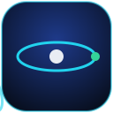
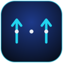
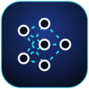
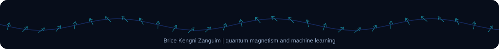

<!-- Profil GitHub de Brice Kengni Zanguim. Les images de assets/ sortent de outils/dessiner.py ;
     les metriques sont regenerees chaque nuit par .github/workflows (voir INSTALLATION.md). -->

  

  

  
  
  

I work where **theoretical physics** meets **machine learning**: quantum magnetism, spin models and
exchange interactions on one side, deep learning and data on the other. I also design and ship
complete software and applications, from the first model to the interface people use.

<table>
  <tr>
    <td width="25%" align="center" valign="top"> <b>Theoretical physics</b> Condensed matter, numerical methods, high-performance computing</td>
    <td width="25%" align="center" valign="top"> <b>Quantum magnetism</b> Spin Hamiltonians, Heisenberg models, exchange couplings, DFT</td>
    <td width="25%" align="center" valign="top"> <b>Machine learning</b> Deep learning, computer vision, NLP, speech, models for physics</td>
    <td width="25%" align="center" valign="top"> <b>Software &amp; apps</b> Python, Rust, APIs, web and mobile apps, cloud deployment</td>
  </tr>
</table>

<table>
  <tr>
    <td width="50%" valign="top">
      <a href="https://brice-kengni-zanguim.github.io/langa/"><b>LANGIAL</b></a> 
      Gives African languages a digital place, in text and voice: a free web app to write, pronounce and look up words, with a dedicated Ngiemboon keyboard. 
       
    </td>
    <td width="50%" valign="top">
      <b>LECTRA</b> (private repository) 
      Offline speech synthesis in 31 languages and audio transcription in 99, running entirely on the user's machine. 
       
    </td>
  </tr>
  <tr>
    <td width="50%" valign="top">
      <b>GCLSTM</b> (private repository) 
      A Python package to define and train a model that couples a graph neural network block with an improved LSTM layer. 
        
    </td>
    <td width="50%" valign="top">
      <b>Banking and microfinance management</b> (private repository) 
      Two Python applications: one runs the operations of a bank, the other manages a microfinance institution. 
      
    </td>
  </tr>
  <tr>
    <td width="50%" valign="top">
      <a href="https://github.com/Brice-KENGNI-ZANGUIM/Images_segmentation_BKZ"><b>Semantic segmentation for autonomous driving</b></a> 
      U-Net, PSPNet and LinkNet compared on street scenes, with data augmentation, served through a FastAPI and Streamlit app. 
        
    </td>
    <td width="50%" valign="top">
      <a href="https://github.com/Brice-KENGNI-ZANGUIM/CI-CD-Azure-function-serverless-for-Recommandation-"><b>Serverless book recommender</b></a> 
      Content recommendation behind an Azure Function with a CI/CD pipeline, a Streamlit front end, and an AWS variant in Docker. 
        
    </td>
  </tr>
  <tr>
    <td width="50%" valign="top">
      <a href="https://github.com/Brice-KENGNI-ZANGUIM/Chatbot"><b>Flight booking chatbot</b></a> 
      A conversational agent that understands booking requests, built on the Microsoft Bot Framework and containerised. 
       
    </td>
    <td width="50%" valign="top">
      <a href="https://github.com/Brice-KENGNI-ZANGUIM/Data_Analysis_App_st"><b>Training analytics app</b></a> 
      Interactive analysis of model training results: statistics, Plotly charts, correlation heatmaps, PDF, CSV and Excel export. 
       
    </td>
  </tr>
  <tr>
    <td width="50%" valign="top">
      <b>edith</b> (private repository) 
      A visual decomposition studio: it splits a poster, a flyer or a logo into editable layers (text, shapes, filled background) that recompose the original exactly. 
       
    </td>
    <td width="50%" valign="top">
      <a href="https://github.com/Brice-KENGNI-ZANGUIM/SPAM_HAM_Naive_bayes"><b>Spam detector</b></a> 
      A Naive Bayes spam filter, with the probabilistic derivation written out step by step. 
      
    </td>
  </tr>
</table>

<table>
  <tr><th align="left">Repository</th><th align="left">Purpose</th><th align="left">Stack</th></tr>
  <tr><td colspan="3"> <b>Machine learning and AI</b></td></tr>
  <tr><td>GCLSTM private</td><td>Graph neural network block coupled with an improved LSTM layer</td><td></td></tr>
  <tr><td>edith private</td><td>Decomposition of visuals into editable, exactly recomposable layers</td><td> </td></tr>
  <tr><td>LECTRA private</td><td>Offline speech synthesis and transcription</td><td></td></tr>
  <tr><td><a href="https://github.com/Brice-KENGNI-ZANGUIM/Images_segmentation_BKZ">Images_segmentation_BKZ</a></td><td>U-Net, PSPNet and LinkNet for street scene segmentation</td><td> </td></tr>
  <tr><td><a href="https://github.com/Brice-KENGNI-ZANGUIM/Image_Segmentation_API">Image_Segmentation_API</a></td><td>API and interface serving the segmentation model</td><td>  </td></tr>
  <tr><td><a href="https://github.com/Brice-KENGNI-ZANGUIM/Chatbot">Chatbot</a></td><td>Flight booking conversational agent</td><td> </td></tr>
  <tr><td><a href="https://github.com/Brice-KENGNI-ZANGUIM/SPAM_HAM_Naive_bayes">SPAM_HAM_Naive_bayes</a></td><td>Spam detection by Naive Bayes</td><td></td></tr>
  <tr><td><a href="https://github.com/Brice-KENGNI-ZANGUIM/Naive-bayes-classify-numeric-datas">Naive-bayes-classify-numeric-datas</a></td><td>Naive Bayes classification of numerical data</td><td></td></tr>
  <tr><td><a href="https://github.com/Brice-KENGNI-ZANGUIM/Cadrage_Projet_IA">Cadrage_Projet_IA</a></td><td>Scoping an AI project</td><td></td></tr>
  <tr><td><a href="https://github.com/Brice-KENGNI-ZANGUIM/OpenClassroom-IAformation">OpenClassroom-IAformation</a></td><td>Projects of my AI engineering training at OpenClassrooms</td><td></td></tr>
  <tr><td colspan="3"> <b>Cloud, APIs and deployment</b></td></tr>
  <tr><td><a href="https://github.com/Brice-KENGNI-ZANGUIM/CI-CD-Azure-function-serverless-for-Recommandation-">CI-CD-Azure-function-serverless-for-Recommandation-</a></td><td>Serverless book recommendation with CI/CD</td><td></td></tr>
  <tr><td><a href="https://github.com/Brice-KENGNI-ZANGUIM/RecommandationLivresStreamlit_LinkAzureFunction">RecommandationLivresStreamlit_LinkAzureFunction</a></td><td>Streamlit front end calling the Azure Function</td><td> </td></tr>
  <tr><td><a href="https://github.com/Brice-KENGNI-ZANGUIM/AWS_RecommandationDeLivres_Docker_ACS_ACR">AWS_RecommandationDeLivres_Docker_ACS_ACR</a></td><td>Containerised deployment of the book recommender</td><td></td></tr>
  <tr><td><a href="https://github.com/Brice-KENGNI-ZANGUIM/API">API</a></td><td>Deployment of machine learning models behind a Flask API</td><td></td></tr>
  <tr><td><a href="https://github.com/Brice-KENGNI-ZANGUIM/API_test">API_test</a></td><td>A Flask API ready for cloud hosting</td><td></td></tr>
  <tr><td colspan="3"> <b>Applications and software</b></td></tr>
  <tr><td><a href="https://brice-kengni-zanguim.github.io/langa/">langa</a></td><td>LANGIAL, African languages in text and voice</td><td></td></tr>
  <tr><td><a href="https://github.com/Brice-KENGNI-ZANGUIM/Data_Analysis_App_st">Data_Analysis_App_st</a></td><td>Analysis of model training results</td><td></td></tr>
  <tr><td>MicroFinance private</td><td>Management of a microfinance institution</td><td></td></tr>
  <tr><td>Bank_Management private</td><td>Operations of a bank</td><td></td></tr>
  <tr><td><a href="https://github.com/Brice-KENGNI-ZANGUIM/stock_management">stock_management</a></td><td>Python package for stock management</td><td></td></tr>
  <tr><td><a href="https://github.com/Brice-KENGNI-ZANGUIM/conversion-units">conversion-units</a></td><td>Unit conversion page</td><td></td></tr>
  <tr><td><a href="https://github.com/Brice-KENGNI-ZANGUIM/Brice-KENGNI-ZANGUIM.github.io">Brice-KENGNI-ZANGUIM.github.io</a></td><td>Personal GitHub Pages site, with maps</td><td></td></tr>
  <tr><td colspan="3"> <b>Science, data and teaching</b></td></tr>
  <tr><td><a href="https://github.com/Brice-KENGNI-ZANGUIM/Signal_Processing">Signal_Processing</a></td><td>Notebooks on signal processing</td><td></td></tr>
  <tr><td><a href="https://github.com/Brice-KENGNI-ZANGUIM/Methodes-de-d-rivation-des-fonctions">Methodes-de-d-rivation-des-fonctions</a></td><td>Methods for differentiating functions</td><td></td></tr>
  <tr><td><a href="https://github.com/Brice-KENGNI-ZANGUIM/Python-pour-les-Mathematiques">Python-pour-les-Mathematiques</a></td><td>Python tools and libraries for mathematics</td><td></td></tr>
  <tr><td><a href="https://github.com/Brice-KENGNI-ZANGUIM/Python__Devenir_Expert">Python__Devenir_Expert</a></td><td>Python, from beginner to expert</td><td></td></tr>
  <tr><td><a href="https://github.com/Brice-KENGNI-ZANGUIM/sondage_analyse_enquete_d_Afrique">sondage_analyse_enquete_d_Afrique</a></td><td>Analysis of a survey conducted in Africa</td><td></td></tr>
  <tr><td><a href="https://github.com/Brice-KENGNI-ZANGUIM/Introduction-to-Github">Introduction-to-Github</a></td><td>My first steps with GitHub</td><td></td></tr>
</table>

  

  

  
  

  

  <picture>
    <source media="(prefers-color-scheme: dark)" srcset="https://raw.githubusercontent.com/Brice-KENGNI-ZANGUIM/Brice-KENGNI-ZANGUIM/output/github-snake-dark.svg"/>
    <source media="(prefers-color-scheme: light)" srcset="https://raw.githubusercontent.com/Brice-KENGNI-ZANGUIM/Brice-KENGNI-ZANGUIM/output/github-snake.svg"/>
    
  </picture>

<b>En français</b>

 

Mon travail se situe à la rencontre de la **physique théorique** et du **machine learning** : magnétisme
quantique, modèles de spin et interactions d'échange d'un côté, apprentissage profond et données de
l'autre. Je conçois aussi des logiciels et des applications complets, du premier modèle jusqu'à
l'interface que l'on utilise.

| Projet | En bref |
| --- | --- |
| LANGIAL | Une place numérique pour les langues d'Afrique, à l'écrit et à l'oral ; clavier ngiemboon dédié. |
| LECTRA | Synthèse vocale en 31 langues et transcription en 99 langues, entièrement sur la machine de l'utilisateur. |
| edith | Un atelier de décomposition des visuels : une affiche, un flyer ou un logo séparé en calques modifiables qui recomposent l'original à l'identique. |
| Détecteur de spam | Filtre bayésien naïf, avec la dérivation probabiliste écrite pas à pas. |
| GCLSTM | Un paquet Python pour définir et entraîner un modèle qui associe un bloc de réseau de neurones sur graphe à une couche LSTM améliorée. |
| Gestion bancaire et microfinance | Deux applications Python : les opérations d'une banque, et la gestion d'une microfinance. |
| Segmentation pour la conduite autonome | U-Net, PSPNet et LinkNet comparés sur des scènes de rue, servis par FastAPI et Streamlit. |
| Recommandation de livres sans serveur | Fonction Azure, chaîne CI/CD, interface Streamlit, variante AWS sous Docker. |
| Agent de réservation de vols | Agent conversationnel bâti sur Microsoft Bot Framework, conteneurisé. |
| Analyse d'entraînements | Statistiques, graphiques Plotly, cartes de corrélation, exports PDF, CSV et Excel. |

Contact : [LinkedIn](https://www.linkedin.com/in/brice-kengni-zanguim/) | [kenzabri2@yahoo.com](mailto:kenzabri2@yahoo.com)

